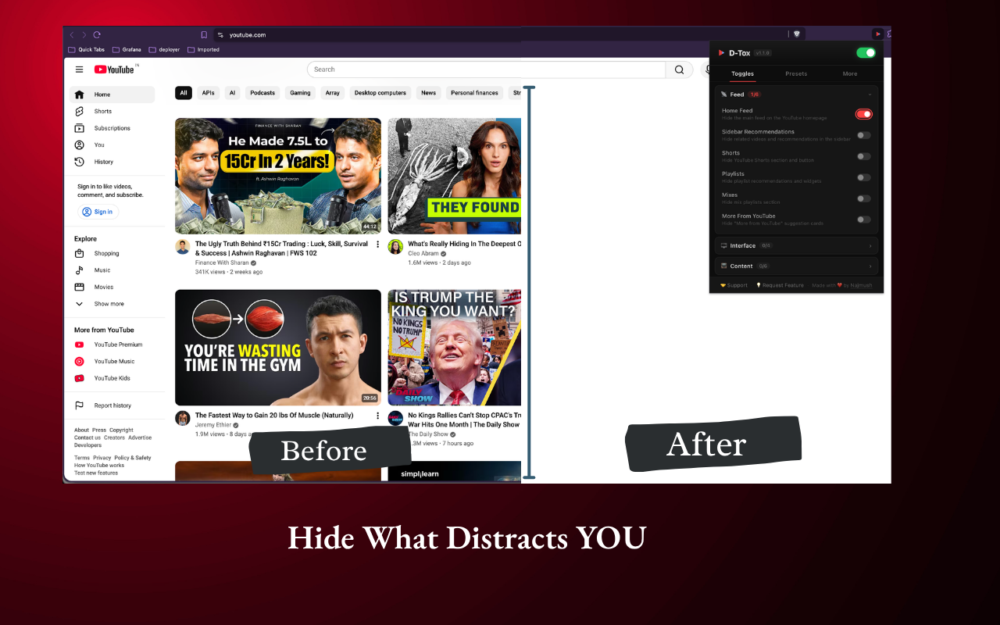
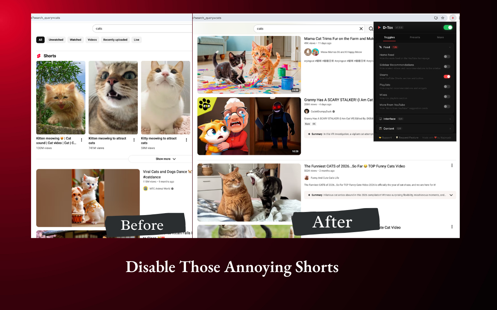
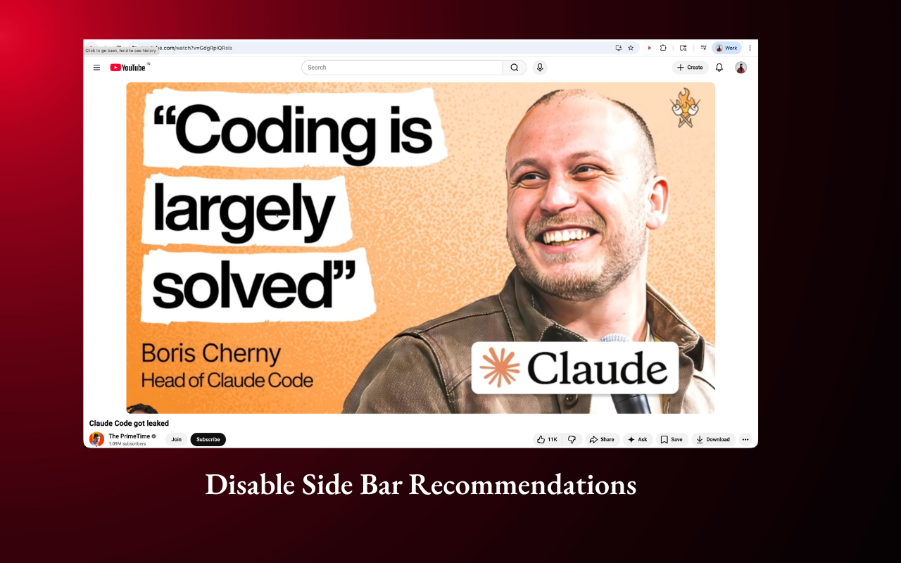
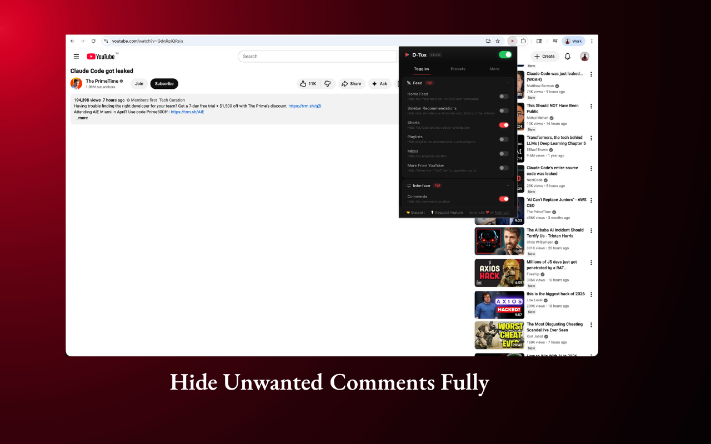

# D-Tox: Detox Your YouTube

Reclaim your attention. D-Tox is a browser extension that strips away YouTube's addictive elements so you only see what you intentionally search for.

## Why

YouTube's algorithm is designed to keep you scrolling. Home feed, Shorts, sidebar recommendations, autoplay — they all exist to maximize your watch time, not your well-being. D-Tox puts you back in control.

## Features

**20 toggle controls** across 5 categories:

| Category | Controls |
|----------|----------|
| Feed | Home Feed, Sidebar, Shorts, Playlists, Mixes, More From YouTube |
| Interface | Comments, Profile Photos, Header, Notifications |
| Content | Live Chat, Fundraiser, Screen Feed, Screen Cards, Merch/Tickets, Video Info |
| Discovery | Explore/Trending, Search Filters |
| Controls | Autoplay, Annotations |

**4 presets** for quick setup:
- **Minimal** — Only search + player. Maximum focus.
- **Focus** — Keep sidebar, hide distractions.
- **Light** — Subtle tweaks, mostly untouched.
- **Custom** — You decide what stays.

**Master toggle** — Pause/enable D-Tox instantly from the header.

**Cross-browser** — Works on Chrome, Brave, Edge, and Firefox.

## Screenshots

| Hide Home Feed | Hide Shorts |
|----------------|-------------|
|  |  |

| Disable Sidebar | Hide Unwanted Comments |
|-----------------|------------------------|
|  |  |

## Install

### Quick install (no code needed)

1. Go to [Releases](https://github.com/najmushsaaquib/d-tox/releases/latest)
2. Download `D-Tox-vX.X.X-chrome.zip`
3. Unzip it anywhere on your computer
4. Open `chrome://extensions` (works on Chrome, Brave, Edge)
5. Enable **Developer mode** (top-right toggle)
6. Click **Load unpacked** → select the unzipped folder
7. Done! Click the D-Tox icon in your toolbar

### From source

```bash
git clone https://github.com/najmushsaaquib/d-tox.git
cd d-tox
npm install
npm run build
```

Then load the extension:

- **Chrome/Brave/Edge**: `chrome://extensions` → Developer Mode → Load Unpacked → select `dist/chrome-mv3/`
- **Firefox**: `about:debugging` → This Firefox → Load Temporary Add-on → select `dist/chrome-mv3/manifest.json`

### Development

```bash
npm run dev            # Dev server with HMR
npm run build          # Production build (Chrome)
npm run build:firefox  # Production build (Firefox)
```

## Project Structure

```
d-tox/
├── entrypoints/           # WXT entry points
│   ├── popup/             # Extension popup (main UI)
│   ├── options/           # Options page
│   ├── content.ts         # YouTube DOM manipulation
│   ├── background.ts      # Service worker
│   └── styles/            # CSS
├── src/
│   ├── utils/             # Storage, CSS injection, types
│   └── constants/         # YouTube element selectors
├── public/                # Icons
├── assets/                # Branding assets
├── dist/                  # Build output (load this in browser)
├── wxt.config.ts          # WXT configuration
└── package.json
```

## How It Works

1. **Content script** runs on youtube.com pages
2. Reads your toggle settings from Chrome Storage
3. Injects a `<style>` tag with CSS rules to hide selected elements — changes apply instantly without page reload
4. Listens to YouTube's native `yt-navigate-finish` SPA event to re-apply rules on every navigation
5. Master toggle can pause all rules instantly

## Contributing

Contributions welcome! Fork, create a branch, make your changes, and submit a PR.

### Adding a new toggle

1. Add the field to `Settings` in `src/utils/types.ts`
2. Add metadata to `FEATURE_METADATA` in the same file
3. Add CSS selector to `HIDE_CSS_RULES` in `src/constants/youtube-elements.ts`
4. Add mapping in `settingToCss` in `src/utils/css-injector.ts`

## Tech Stack

- **WXT** — Cross-browser extension framework
- **React 19** — UI
- **TypeScript** — Type safety
- **Chrome Storage API** — Settings persistence

## Support

- **Support the project**: Click 🤝 Support in the extension popup — share it, or contribute financially via PayPal / UPI
- **Feature Request**: [Submit here](https://forms.gle/B1eb14KJGTRoiS179)
- **Bug Report**: [Submit here](https://forms.gle/dLTobfdskRPJ6poY6)

## License

MIT

---

Made with ❤️ by [Najmush](https://najmushsaaquib.com) • [Open Source](https://github.com/najmushsaaquib/d-tox)
